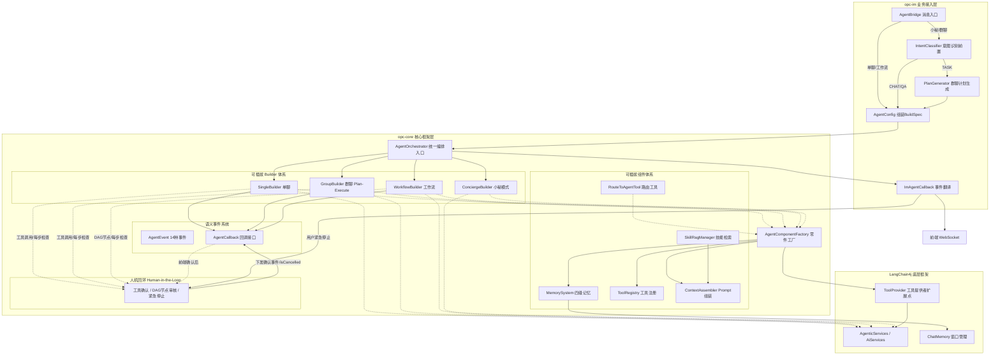
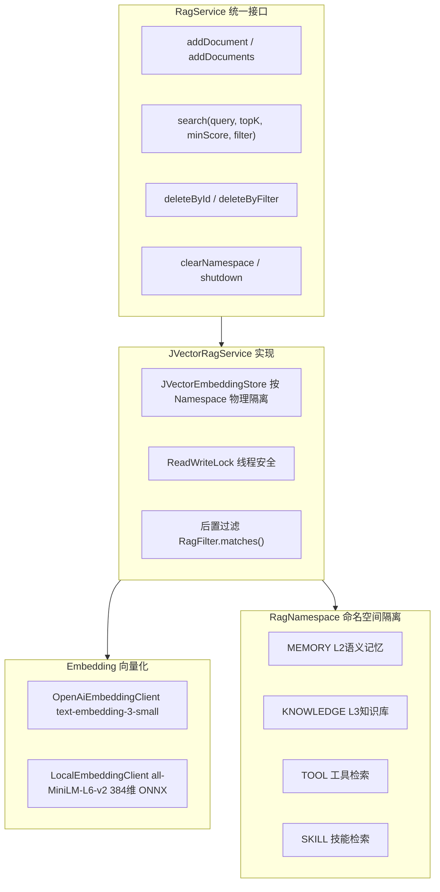
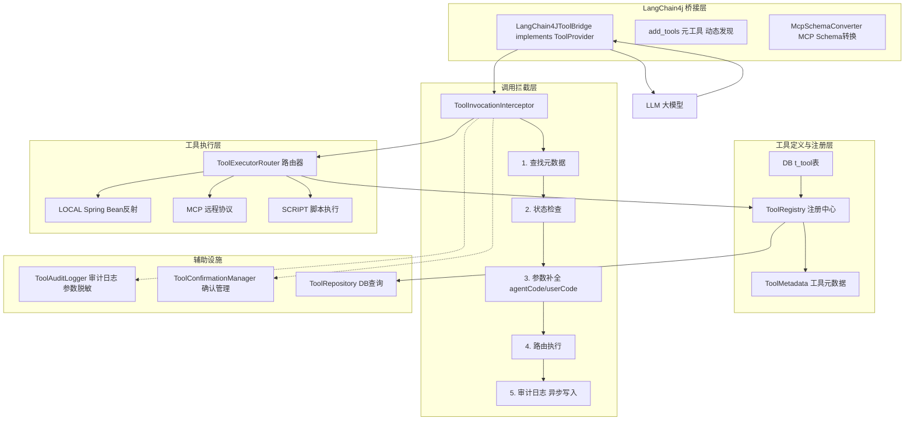
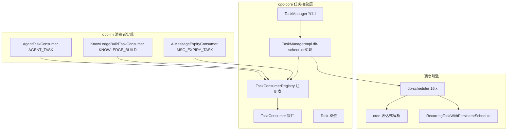

# DPSK-OPC — Agent IM 系统

基于 **LangChain4j** 构建的 Agent IM 系统，支持多 Agent 协作、RAG 知识库、工具统一管理及多种对话模式。后端 Java + 前端 React，通过 jpackage + Electron 打包为跨平台桌面应用。

---

## 目录

- [0. 架构哲学：LLM 时代的工程观](#0-架构哲学llm-时代的工程观)
- [1. 整体架构](#1-整体架构)
- [2. Agent 执行框架](#2-agent-执行框架)
- [3. 多级记忆系统](#3-多级记忆系统)
- [4. RAG 知识库](#4-rag-知识库)
- [5. Tool 工具平台](#5-tool-工具平台)
- [6. Skill 技能系统](#6-skill-技能系统)
- [7. 动态任务调度](#7-动态任务调度)
- [8. 工作流编排](#8-工作流编排)
- [9. 协作模式](#9-协作模式)
- [10. 项目结构](#10-项目结构)
- [11. 后续规划](#11-后续规划)

---

## 0. 架构哲学：LLM 时代的工程观

### 0.1 核心命题

> **"怎样更好更快地使用 LLM 能力"** — 这是 Agent 开发唯一要回答的问题。

所有"新概念"——Agent、RAG、Tool Calling、Memory、Skill、Plan-and-Execute——本质上都是老工程问题换了个壳。真正的架构挑战不在于发明概念，而在于如何将 LLM 的不确定性装进工程化的笼子里。

### 0.2 概念的本质还原

| 新概念 | 本质 | 对应传统工程问题 |
|--------|------|-----------------|
| Agent | 带上下文的 function call | 服务封装 + 会话管理 |
| RAG | 带索引的检索 + 拼 prompt | 搜索引擎 + 模板引擎 |
| Tool Calling | LLM 友好封装的 RPC | API Gateway + Schema 转换 |
| Memory | 带策略的消息裁剪 + 摘要 | 缓存管理 + 数据压缩 |
| Skill | 领域知识的 prompt template | 知识库 + 规则引擎 |
| Plan-and-Execute | 任务拆解 + DAG 编排 + 结果传递 | 工作流引擎 |
| Multi-Agent | 多个 function call 的编排 | 分布式任务调度 |

**结论**：Agent 开发没有新东西，只是把过去几十年的分布式系统、搜索引擎、工作流引擎的经验，用 LLM 这个新的"计算单元"重新实现了一遍。

### 0.3 三个真正的工程问题

所有 Agent 框架的设计，本质上在解决三个问题：

**问题一：怎么把 LLM 能力封装得更好调用**

→ Agent 抽象、Tool 抽象、Skill 抽象，都是为了让业务方不关心 prompt 拼接、工具注册、记忆管理等底层细节。一个 `AgentPipeline.execute()` 调用背后，框架自动完成了人设注入、记忆组装、工具 Schema 转换、结果解析。

**问题二：怎么让 LLM 输出更可控**

→ 意图识别前置（规则 + 轻量 LLM 分类）、Plan 显式化（提前生成执行计划）、确认机制（危险操作挂起）、Replanner（执行失败后重规划），都是在对抗 LLM 固有的不确定性。**LLM 擅长"生成"，不擅长"决策"——工程层的职责就是把"决策"从 LLM 手里拿回来**。

**问题三：怎么组织多步骤/多角色的协作**

→ Workflow DAG（静态编排）、Plan-and-Execute（动态编排）、SupervisorAgent（隐式调度），本质都是"任务编排"，区别在于编排粒度、DAG 来源（用户定义 vs LLM 生成）、用户可见性。

### 0.4 Big Model vs Big Engineering

关于"模型发展会不会取代 Engineering"的争论：

**观点一：复杂度守恒定律**

> "系统的复杂度不会消失，只会转移。"

如果模型厂商把 Tool Calling、RAG、Memory 全内化到模型里，训练数据膨胀、推理架构变重、部署运维爆炸。复杂度从应用层转移到模型层，但总量不变，甚至因为"通用性"要求而增加。

**观点二：LLM 的核心能力边界**

```
大脑（LLM 该做的）：  理解意图 → 推理决策 → 生成内容
手脚（Engineering 该做的）：工具执行 → 知识检索 → 状态管理 → 安全边界
```

现在的 Tool Calling 本质是 LLM 输出一个 JSON，Engineering 去执行。模型厂商的"支持 tool calling"只是多训练了一个输出 JSON Schema 的能力，真正执行永远是工程侧的事。

**观点三：私有部署天然需要外挂**

企业场景的刚需——私有知识库、内部 API、审计合规、权限控制——不是"模型能不能做"，而是"模型允不允许做"。必须有一层 Engineering 在模型和实际执行之间做代理 + 管控。

**结论**：

```
┌─────────────────────────────────┐
│  模型层（大脑）                    │
│  理解 + 推理 + 生成                │
│  输出标准化的 action schema        │  ← 模型厂商能做的极限
└──────────┬──────────────────────┘
           │ 标准化接入点
           ▼
┌─────────────────────────────────┐
│  工程层（手脚 + 边界）              │
│  Tool Registry / RAG / Memory    │
│  Auth / Audit / RateLimit        │
│  Workflow / Plan-Execute         │
└─────────────────────────────────┘
```

**模型能力越强，工程层的价值不是变小，而是从"弥补模型不足"变成"放大模型能力 + 守住安全边界"**。Engineering 不会消失，只是不断上移——从帮模型走路变成告诉模型哪里不能去。

### 0.5 本项目的架构定位

opc-core 就是这个"工程层"的抽象骨架：

```
Agent Pipeline  ← 执行单元封装
Tool Registry   ← 工具接入点（本地/MCP/脚本三合一）
RagService      ← 知识接入点（向量库可插拔）
MemorySystem    ← 记忆接入点（四级按需组装）
SkillRagManager ← 技能接入点（多粒度检索）
```

模型换谁不重要，这层 Engineering 才是系统的核心资产。未来模型能力演进，只需替换底层的 `ChatModel` 实现，整个工程层的抽象、接口、事件体系保持不变。

---

## 1. 整体架构

系统采用 **三层分离** 架构，opc-core 定义接口与抽象，opc-im 做业务适配与实现，底层基于 LangChain4j 提供 AI 能力。



**核心设计理念**：opc-core 是纯接口层，定义了 Agent 执行的完整生命周期，不绑定任何基础设施。opc-im 通过 Spring Boot + MyBatis 实现所有接口，完成 DB 存取、WebSocket 推送、用户认证等业务适配。新增聊天模式只需实现 `AgentBuilder` 接口并注册到 `AgentOrchestrator` 即可。

**IntentClassifier（意图识别前置）**：对于小秘等路由型 Agent，在 `AgentBridge.dispatchSingle()` 中通过代码层（规则 + 轻量 LLM）做意图分类，区分 CHAT（闲聊）/ QA（知识问答）/ TASK（任务路由）三种意图，按需加载不同工具，避免把路由逻辑写在 Prompt 中。

**Plan-and-Execute（群聊模式）**：群聊采用 Plan-and-Execute 架构替代传统的 SupervisorAgent。通过轻量 LLM 动态生成执行计划（ExecutionPlan），用 LangGraph4j 组织 DAG 逐步执行，每个步骤复用现有的 Agent Pipeline。支持失败时 Replan（最多 1 次），前端可实时展示计划进度。

**ToolProvider 扩展点**：`LangChain4JToolBridge` 实现了 LangChain4j 提供的 `ToolProvider` 接口，这是 LC4j 原生的工具提供者扩展点。通过 `AgentComponentFactory.getToolProviders()` 注入到 `AgenticServices` 中，LLM 在每轮对话时通过 `provideTools()` 获取可用工具列表，通过 `execute()` 回调执行工具调用。该扩展点支持动态工具发现——首轮只提供 `add_tools` 元工具，LLM 按需声明后下一轮再加载真实工具 Schema，避免一次性把所有工具 Schema 塞给 LLM 造成 Token 浪费。

**人机回环（Human-in-the-Loop）**：系统在三个层面实现人机回环机制，确保关键操作可控：

- **工具确认**：通过 `CommandSafetyChecker` 对工具进行分级（SAFE/BLOCKED/CONFIRM）和命令关键字识别，危险操作由 `ToolInvocationInterceptor` 拦截后通过 `AgentCallback` 下发确认事件，前端展示确认弹窗，用户选择后写入 `ConfirmationQueue`，`ToolConfirmationManager` 根据确认结果决定继续执行或取消。
- **DAG 节点确认/审核**：工作流中的人工确认节点执行时，通过 `WORKFLOW_MSG_CONFIRM` 事件向用户发起审核请求，阻塞等待用户确认后继续执行后续节点。
- **紧急停止**：所有 Pipeline（SinglePipeline/GroupPlanPipeline/WorkflowPipeline）在每个关键步骤（thinking 输出、消息输出、工具调用前后、完成回调）都会检查 `callback.isCancelled()`。前端通过 WebSocket 下发停止指令，`ImAgentCallback` 设置停止标记，框架检测到后立即中断执行并发射 `CANCELLED` 事件。

三种人机回环的确认实现统一：下发确认事件 → 阻塞等待 → 前端确认后写入确认队列 → 读取确认选项 → 根据选项继续/取消/重试。

---

## 2. Agent 执行框架

### 2.1 统一执行流程

所有聊天模式（单聊/小秘/群聊/工作流）复用同一套执行流程：

```
用户消息 → AgentBridge.dispatch()
  → 组装 AgentBuildSpec (mode + 上下文)
  → AgentOrchestrator.execute(spec, callback)
    → 根据 mode 路由到对应 Builder
    → Builder.build(spec) → AgentPipeline
    → Pipeline.execute(callback)
      → 通过 AgentCallback 发射语义事件
      → ImAgentCallback 翻译为 WsMessage 推送前端
```

### 2.2 核心接口

| 接口/类 | 职责 |
|---------|------|
| `AgentOrchestrator` | 统一入口，策略模式路由到对应 Builder |
| `AgentBuilder` | Builder 接口，每种模式一个实现 |
| `AgentPipeline` | 执行管道，封装 LLM 调用 + 事件发射 |
| `AgentBuildSpec` | 构建规范，统一入参（mode/userCode/agentCode/...） |
| `AgentCallback` | 回调接口，opc-core 发射事件，opc-im 翻译协议 |
| `AgentComponentFactory` | 共享零件工厂（LLM模型/ChatMemory/ToolProvider/Prompt） |

### 2.3 运行模式

| 模式 | 常量 | Builder | Pipeline | 执行引擎 |
|------|------|---------|----------|----------|
| 单聊 | `MODE_SINGLE` | `SingleBuilder` | `SinglePipeline` | AgenticServices |
| 小秘 | `MODE_SINGLE` | `ConciergeBuilder` | `SinglePipeline` | AgenticServices + RouteToAgentTool |
| 群聊 | `MODE_GROUP` | `GroupBuilder` | `GroupPlanPipeline` | LangGraph4j |
| 工作流 | `MODE_WORKFLOW` | `WorkflowBuilder` | `WorkflowPipeline` | LiteFlow |

### 2.4 语义事件系统

这是 **opc-core 与 opc-im 的解耦关键**。core 层不关心消息如何推送，只发射标准化语义事件。`ImAgentCallback` 实现 `AgentCallback`，负责将事件翻译为 WebSocket 协议推送给前端，同时完成消息落库和 Token 用量记录。如果将来需要接入其他协议（SSE/gRPC Stream），只需实现新的 Callback 即可。

#### 2.4.1 事件类型（AgentEventType 枚举，共 14 种）

| 事件类型 | 含义 | 携带数据 |
|----------|------|----------|
| `THINKING` | Agent 开始思考推理 | agentCode, text |
| `TOOL_CALL` | LLM 决定调用工具 | agentCode, toolName, toolInput |
| `TOOL_CALL_CHUNK` | 工具调用结果增量 | agentCode, text |
| `TOOL_RESULT` | 工具调用返回结果 | agentCode, toolName, toolOutput |
| `STREAM_CHUNK` | 思考过程流式增量 | agentCode, text(delta) |
| `STREAM_CHUNK_END` | 思考过程结束 | agentCode |
| `MESSAGE` | 正文消息开始 | agentCode, text |
| `MESSAGE_CHUNK` | 正文流式增量 | agentCode, text(delta) |
| `MESSAGE_CHUNK_END` | 正文流式结束 | agentCode |
| `DONE` | 执行完成（含完整结果） | agentCode, meta(Map) |
| `ERROR` | 执行异常 | agentCode, text(errorMsg) |
| `CANCELLED` | 用户取消执行 | agentCode |
| `MSG_READ` | 消息已读回执 | agentCode, text(messageCode) |
| `WORKFLOW_MSG_CONFIRM` | 工作流人工确认通知 | agentCode, text(确认信息) |

#### 2.4.2 Plan-and-Execute 事件（群聊模式专属，复用以上事件体系）

群聊 Plan-and-Execute 流程在以上 14 种事件基础上，额外使用以下事件来表示计划生命周期：

| 事件类型 | 触发时机 | 说明 |
|----------|----------|------|
| `MESSAGE` (plan_start) | 开始规划任务 | 前端展示"正在规划..." |
| `MESSAGE` (plan_ready) | 规划完成 | 携带 ExecutionPlan JSON，前端展示步骤列表 |
| `TOOL_CALL` (step_start) | 步骤开始执行 | toolName=stepId, toolInput=agentCode |
| `TOOL_RESULT` (step_done) | 步骤执行完成 | toolName=stepId, toolOutput=result |
| `DONE` (plan_done) | 全部步骤完成 | meta 含最终汇总结果 |

群聊执行过程中，子 Agent 的内部事件（THINKING/TOOL_CALL/MESSAGE_CHUNK 等）透传给前端，实现步骤级别的进度可视化。

#### 2.4.3 AgentEvent 工厂方法

| 工厂方法 | 事件类型 |
|----------|----------|
| `AgentEvent.thinking(agentCode, text)` | THINKING |
| `AgentEvent.streamChunk(agentCode, delta)` | STREAM_CHUNK |
| `AgentEvent.streamChunkEnd(agentCode)` | STREAM_CHUNK_END |
| `AgentEvent.toolCall(agentCode, name, input)` | TOOL_CALL |
| `AgentEvent.toolResult(agentCode, name, output)` | TOOL_RESULT |
| `AgentEvent.done(agentCode, meta)` | DONE |
| `AgentEvent.error(agentCode, message)` | ERROR |
| `AgentEvent.msgRead(agentCode, messageCode)` | MSG_READ |

其余事件类型（TOOL_CALL_CHUNK / MESSAGE / MESSAGE_CHUNK / MESSAGE_CHUNK_END / CANCELLED / WORKFLOW_MSG_CONFIRM）在代码中直接通过 `new AgentEvent(...)` 构造。

#### 2.4.4 AgentCallback 接口

```java
public interface AgentCallback {
    void onEvent(AgentEvent event);                    // 收到一个语义事件
    default void onComplete() {}                       // 执行正常结束
    default void onError(Throwable error) {}           // 执行异常终止
    default boolean isCancelled() { return false; }    // 检查是否已取消
}
```

群聊场景使用子接口 `GroupAgentCallback extends AgentCallback`，额外提供 `setStreamCode(streamCode)` 和 `setSenderInfo(agentCode)` 方法，用于标识流式消息的归属。

---

## 3. 多级记忆系统

基于 `MemorySystem` Builder 模式按需组装四级记忆：

```
L0 工作记忆（ChatMemory）
  ├── MessageWindowChatMemory（窗口大小 20 条消息）
  └── 移出窗口时触发 MemoryManager.onMessagesEvicted()

L1 摘要记忆（SummaryManager）
  ├── 增量摘要生成（旧摘要 + 新对话 → LLM 合并）
  └── 注入 System Prompt："[近期往事] ..."

L2 语义记忆（FactManager）— 纯 RAG 模式
  ├── 消息移出 L0 → 向量化存入 EmbeddingStore
  ├── 每次对话 → 语义检索 Top-K 相关历史消息（带时间衰减加权）
  └── 注入 System Prompt："[相关历史消息] ..."

L3 知识库记忆（KnowledgeManager）
  ├── 从知识库向量库检索相关内容
  ├── 分级注入：HIGH(>=0.90) 强约束 / MEDIUM(0.75~0.90) 参考 / LOW(<0.75) 不注入
  └── 注入 System Prompt："[请严格基于以下知识库内容回答]"
```

**ContextAssembler** 负责按固定顺序组装最终 Prompt：

```
人设 → L3知识库 → L1摘要 → @引用 → L2语义检索 → L0工作记忆 → 当前消息
```

所有组件都是 Builder 模式按需组装。简单场景可以只用 L0，复杂场景可以启用完整四级。支持四种构建模式：
- **L0 Only**：仅工作记忆
- **L0 + L1**：工作记忆 + 摘要
- **L0 + L1 + L2**：工作记忆 + 摘要 + 语义记忆
- **L0 + L1 + L2 + L3**：完整四级记忆

### 3.1 完整 Prompt 示例

以下展示一个启用了完整四级记忆（L0+L1+L2+L3）的 Agent 在一次对话中组装出的完整 System Prompt：

```text
你是一个名为「技术顾问」的 AI 助手，专门解答技术问题。
你的回答应该专业、准确、简洁。
你具备以下能力：
- 查询天气
- 代码生成
- 数据分析
- 文档检索

[请严格基于以下知识库内容回答，不要自由发挥]
- Spring Boot 3.x 默认使用 Jakarta EE 9+，javax.* 包已迁移至 jakarta.*
- 数据库连接池推荐使用 HikariCP，它是 Spring Boot 2.x+ 的默认连接池
- JVector 是基于 DiskANN 算法的高性能向量数据库，支持纯 Java 环境部署

[近期往事]
用户之前询问过关于微服务架构的技术选型问题。
用户提到他们团队目前使用 Java 17 + Spring Boot 3.2。
用户的数据库是 PostgreSQL 15。

[引用消息]
用户 @引用了一条消息："有没有适合小团队的向量数据库推荐？"
上下文：
  张三：我们团队只有 3 个后端，想找一个轻量的向量数据库
  李四：Milvus 太重了，有没有纯 Java 的方案？
  张三：对，最好不需要额外部署服务的

[相关历史消息]
- 用户: "LangChain4j 怎么接入本地向量数据库？" | 助手: "可以使用 JVector，它完全在 JVM 内运行..."
- 用户: "我们用的是 Spring Boot 3" | 助手: "Spring Boot 3 对应的是 Jakarta EE，注意包名变化..."
- 用户: "Embedding 模型用哪个好？" | 助手: "本地可以用 all-MiniLM-L6-v2..."

[当前对话]
用户: 张三
助手: 你好张三，有什么可以帮你的？
用户: 帮我看看怎么部署 JVector
```

**组装逻辑说明**：

1. **人设**（最顶层）：来自 Agent 配置的 prompt，定义角色、能力和行为准则
2. **L3 知识库**：检索到的知识库内容，根据分数分为 HIGH（强约束，告诉 LLM 严格基于知识库回答）或 MEDIUM（参考信息）
3. **L1 摘要**：`SummaryManager` 生成的增量摘要，提炼历史对话的关键事件和用户偏好
4. **@引用**：用户引用的消息 + 前后各 2 条上下文消息
5. **L2 语义记忆**：与当前 query 语义相似的历史消息，带时间衰减加权后取 Top-3
6. **L0 工作记忆**：当前对话窗口内的最近 20 条消息
7. **当前消息**：用户刚发送的消息

---

## 4. RAG 知识库

### 4.1 架构设计

基于 `RagService` 统一接口抽象，底层向量数据库可插拔（当前使用 JVector 实现）。



### 4.2 核心能力

| 能力 | 说明 |
|------|------|
| **多 Namespace 物理隔离** | MEMORY/KNOWLEDGE/TOOL/SKILL 独立向量文件，互不干扰 |
| **RagFilter 条件过滤** | 支持 equals / in / notEquals / gte / lte / contains 六种过滤，AND 关系 |
| **双 Embedding 策略** | OpenAiEmbeddingClient（远程 API）和 LocalEmbeddingClient（本地 ONNX）可切换 |
| **滑动窗口分块** | 基于 Stanford CoreNLP 分句 + 滑动窗口合并（窗口 3 句，步长 1 句，67% 重叠），保证语义连续性 |
| **双粒度索引** | Sentence-level chunks（滑动窗口，用于语义检索匹配）+ Paragraph-level chunks（完整段落，用于上下文扩展） |
| **噪声过滤** | 自动过滤纯标点/纯数字/过短句子/URL行/页眉页脚等无意义内容 |
| **文件解析** | Apache Tika 支持 30+ 文件格式（txt/md/java/py/js/json/xml/pdf/docx/xlsx/html 等） |
| **文本清洗** | TextCleaner 链式配置（去 HTML 标签/控制字符/零宽字符/Markdown 标记/URL/中文间空格等） |
| **Query 改写** | 规则改写（去除礼貌用语、提取关键短语）+ 可选 LLM 改写（对复杂 query 生成多角度检索词） |
| **多路检索** | 向量检索（JVector ANN）+ 关键词检索（内存倒排索引 TF-IDF）+ 实体检索（metadata 精确过滤），RRF 融合排序 |
| **Rerank 精排** | 粗排取 topK×3 候选 → Cross-Encoder（bge-reranker-v2-m3 ONNX batch 推理）精排 → 取 topK；也支持规则 Rerank 兜底 |
| **段落上下文扩展** | 检索命中 sentence-level chunk → 通过 paragraph_index 查出对应段落 → 扩展前后各 1 段，解决句子粒度语义零碎问题 |
| **分句切分** | Stanford CoreNLP tokenize+ssplit 准确分句 |

### 4.3 RAG 全链路流程

```
┌───────────────┬──────────────┬──────────────┬───────────────────────┐
│   索引阶段     │   Query 改写  │   多路检索    │   后处理               │
│               │              │              │                       │
│  文档解析      │  规则改写     │  向量检索     │   Rerank 精排          │
│   (Tika)      │  (去礼貌用语) │  (JVector)   │   (Cross-Encoder)     │
│    ↓          │   +          │  +           │    ↓                  │
│  文本清洗      │  LLM 改写     │  关键词检索   │   段落上下文扩展        │
│   (TextCleaner)│  (多query)   │  (TF-IDF)    │   (前后各1段)          │
│    ↓          │              │  +           │    ↓                  │
│  滑动窗口分块   │              │  实体检索     │   注入 LLM Prompt      │
│   (窗口3句步1) │              │  (metadata)  │                       │
│    ↓          │              │              │                       │
│  噪声过滤      │              │  → RRF 融合   │                       │
│    ↓          │              │              │                       │
│  双粒度索引     │              │              │                       │
│  (句子级+段落级)│              │              │                       │
└───────────────┴──────────────┴──────────────┴───────────────────────┘
```

### 4.4 知识库构建流程

```
文件上传（UPLOADED 状态）
  → 定时任务每5分钟触发 KnowledgeBuildService.build()
    → Apache Tika 解析文件内容
    → TextCleaner 清洗文本
    → Stanford CoreNLP 分句
    → 滑动窗口分块（窗口 3 句，步长 1 句）
    → ChunkFilter 噪声过滤
    → EmbeddingClient 向量化
    → 双粒度存入 JVector（KNOWLEDGE namespace）
      ├── Sentence-level chunks（grain=sentence，用于检索匹配）
      └── Paragraph-level chunks（grain=paragraph，用于上下文扩展）
    → 状态流转 UPLOADED → ANALYZING → LEARNED / FAILED
```

### 4.5 检索全链路耗时

基于 8 核 CPU、1 万条 chunks、AllMiniLmL6V2 embedding 模型的环境：

| 环节 | 耗时 | 占比 |
|------|------|------|
| Query 改写（规则） | ~5ms | 2% |
| Embedding 向量化 | ~15ms | 6% |
| JVector ANN 检索 | ~10ms | 4% |
| **Cross-Encoder Rerank**（9 candidates batch） | **~200ms** | **80%** |
| 段落上下文扩展 | ~10ms | 4% |
| 其他开销 | ~10ms | 4% |
| **总计** | **~250ms** | |

Rerank 是全链路最大的耗时瓶颈，但也贡献了最大的 Precision 提升（+8~15%）。batch 推理（9 条 ~200ms）比逐条推理（450~1350ms）快 3-5 倍。全链路 250ms 在用户感知阈值（500ms）以内，对体验影响有限。

### 4.6 RAG 评估体系

系统内置 `RagEvaluator` 评估引擎，支持自动化召回率测试：

**评估流程**：
```
准备测试文档（PDF/HTML/TXT/DOCX/XLSX）
  → 标注 QA 对（question + answer + relevant_chunk_ids）
  → 索引文档 → 逐条检索 → 计算指标 → 输出报告
```

**评估指标**：

| 指标 | 说明 | 目标值 |
|------|------|--------|
| Hit Rate | 至少命中 1 个相关 chunk 的 query 比例 | ≥ 90% |
| Recall@5 | top5 中覆盖的相关 chunk 比例 | ≥ 80% |
| Precision@5 | top5 中相关 chunk 的占比 | ≥ 60% |
| MRR | 第一个相关 chunk 排名的倒数均值 | ≥ 0.70 |
| NDCG@5 | 考虑排序位置的归一化指标 | ≥ 0.75 |

---

## 5. Tool 工具平台

### 5.1 架构图



### 5.2 核心设计

**三层架构**：注册层（ToolRegistry）→ 桥接层（LangChain4JToolBridge）→ 执行层（ToolExecutorRouter）

| 层次 | 组件 | 职责 |
|------|------|------|
| 注册层 | `ToolRegistry` | DB 加载工具到内存，按 Agent 过滤，支持热重载 |
| 桥接层 | `LangChain4JToolBridge` | 实现 LC4j `ToolProvider`，Schema 转换，动态工具发现 |
| 拦截层 | `ToolInvocationInterceptor` | 权限检查、参数补全（agentCode/userCode/conversationCode/traceId）、路由执行、审计日志 |
| 执行层 | `ToolExecutorRouter` | 路由到 LOCAL（Spring Bean 反射）/ MCP（远程协议）/ SCRIPT（脚本） |
| 辅助层 | `ToolAuditLogger` | 异步审计日志，敏感参数脱敏（password/secret/token/key） |

### 5.3 动态工具发现

```
首轮对话（UserMessage）
  → provideTools() 只返回 add_tools 元工具
  → LLM 分析意图，调用 add_tools(["search", "weather"])
  → 下一轮 provideTools() 返回 LLM 指定的工具 Schema
  → LLM 用真实工具执行业务操作
```

这种设计避免一开始把所有工具 Schema 塞给 LLM（浪费 Token），让 LLM 按需加载。

### 5.4 危险工具确认机制

通过 `ToolConfirmationManager` 支持高风险操作挂起确认：
- 危险工具执行前挂起，等待用户在前端确认
- 确认后继续执行，拒绝则返回终止状态
- 全程有审计日志记录

---

## 6. Skill 技能系统

### 6.1 设计理念

Skill 定位为**可复用的领域知识 + 操作流程**，通过 RAG 语义检索匹配后注入 System Prompt。

与 Tool 的区别：
- **Tool**：LLM 可直接调用的函数，有严格的输入输出 Schema
- **Skill**：领域知识和操作指南，通过 RAG 检索匹配后注入 Prompt，告诉 LLM "怎么做事"

### 6.2 核心架构

```
SkillDoc（技能定义）
  ├── skillId / skillName
  ├── fullDescription（完整描述）
  ├── searchTexts（检索锚点，短文本）
  ├── keywords（关键词）
  ├── triggerQuestions（典型触发问题）
  └── metadata（业务元数据）

SkillIndexBuilder（多粒度索引拆分）
  ├── searchTexts → 每条独立文档（grain=search_text）
  ├── keywords → 拼接为一条（grain=keyword）
  └── triggerQuestions → 每条独立文档（grain=trigger_question）

SkillRagManager（检索管理）
  ├── indexSkill() → 多粒度写入向量库
  └── searchSkills() → 多粒度检索 → source_id 去重 → Top-K
```

### 6.3 核心策略

**RAG 做"海选"，LLM 做"决赛"**：
1. 多粒度索引提升召回率（searchText + keywords + triggerQuestions 三个维度）
2. 检索时放大 fetch 数量（topK * 3），按 source_id 去重取最高分
3. 支持 RagFilter 做权限/状态/归属过滤

---

## 7. 动态任务调度

### 7.1 架构设计

基于 **db-scheduler** 实现集群安全的定时任务调度，通过 `TaskConsumer` 接口实现可扩展的任务消费体系。



### 7.2 任务类型

| 类型 | 常量 | 说明 |
|------|------|------|
| 定时任务 | `TYPE_SCHEDULED` | 按 cron 表达式自动执行 |
| 手动任务 | `TYPE_MANUAL` | 用户手动触发 |
| AI 指令 | `TYPE_AI_COMMAND` | LLM 动态创建 |
| 工作流 | `TYPE_WORKFLOW` | 工作流节点触发 |
| TODO | `TYPE_TODO` | 待办事项（预留） |

### 7.3 内置任务

| 任务 | Consumer Key | Cron | 功能 |
|------|-------------|------|------|
| 知识库构建 | `KNOWLEDGE_BUILD` | `0 3/5 * * * ?` | 每5分钟解析新文件并向量化 |
| 消息过期清理 | `MSG_EXPIRY_TASK` | `0 0/20 * * * ?` | 每20分钟清理过期消息 |
| AI 定时任务 | `AGENT_TASK` | 用户自定义 | 定时触发 AI 执行（支持锚点上下文） |

### 7.4 AI 定时任务执行流程

```
cron 触发 → TaskManagerImpl 调度
  → AgentTaskConsumer.consume()
    1. 解析 parameters（userId/prompt/anchorMsgCode）
    2. 通过 anchorMsgCode 查询创建任务时的对话上下文
    3. 创建 ChatMessage 模拟用户触发
    4. 组装 AgentBuildSpec（含 taskContext 锚点上下文）
    5. TaskCreationContext.set() 透传参数
    6. AgentOrchestrator.execute() 执行 AI 流程
    7. TaskCreationContext.clear() 清理
```

---

## 8. 工作流编排

### 8.1 双框架支持

系统支持两种工作流引擎，应对不同场景：

| 框架 | 适用场景 | 特点 |
|------|---------|------|
| **LiteFlow** | 无环单向 DAG（专家团） | 确定性流程，规则链执行 |
| **LangGraph4j** | 有环 DAG（群聊 Plan-Execute / 复杂决策） | 循环/条件回退，支持 Replan |

### 8.2 LiteFlow 节点类型

| 节点 | 类型 | 功能 |
|------|------|------|
| `StartNodeProcessor` | 开始节点 | 初始化上下文，记录执行日志 |
| `AgentNodeProcessor` | Agent 执行 | 调用 AgentOrchestrator 执行 AI，支持独立 MCP/Skill 配置 |
| `SwitchNodeProcessor` | 条件分支 | 用 LLM 判断走哪个分支 |
| `HumanConfirmNodeProcessor` | 人工确认 | WebSocket 通知前端，120s 超时等待确认/拒绝 |
| `EndNodeProcessor` | 结束节点 | 标记任务成功 |

### 8.3 人工确认流程

```
HumanConfirmNodeProcessor
  → WorkflowConfirmManager.requestConfirm(taskCode, nodeId)
  → WsMessage(TASK_CONFIRM) 推送前端
  → 阻塞等待 120 秒
    ├── 用户确认 → 继续执行下一节点
    ├── 用户拒绝 → 任务取消
    └── 超时 → 抛出异常，终止流程
```

---

## 9. 协作模式

### 9.1 小秘 Agent（Concierge / 路由型 Agent）

#### 9.1.1 定位

小秘是**系统自带的基础 Agent**，也是一类通用的"路由型 Agent"模式。它不是特殊编码的 Agent，而是 `AGENT-LOCAL` 类型下 `category = CONCIERGE` 的普通 Agent。同样的机制可扩展为企业人事机器人、客服机器人等。

小秘承担三个层次的能力：

```
小秘 Agent
├── 层次1: 日常聊天
│     "你好"、"今天心情怎么样"、"讲个笑话"
│     → LLM 直接回复
│
├── 层次2: 系统介绍（RAG）
│     "你是什么系统"、"有哪些功能"、"怎么使用"
│     → RAG 检索（系统默认知识库）+ LLM 回复
│
└── 层次3: 任务执行（路由）
      "帮我查天气"、"写个代码"、"分析财报"
      → RouteToAgentTool → 动态路由到专业 Agent
```

#### 9.1.2 意图识别前置

意图识别是**代码层面的前置判断**（不是靠 Prompt），在 `AgentBridge.dispatchSingle()` 中，构建 `AgentBuildSpec` 之前完成：

```
用户消息
  │
  ▼
IntentClassifier.classify(message, agentContext)
  │
  ├── Step 1: 规则快速命中
  │     ├── 纯问候语正则 → CHAT
  │     ├── 系统关键词（怎么用/帮助/功能）→ QA
  │     └── 未命中 → Step 2
  │
  └── Step 2: 轻量 LLM 分类（小模型，温度=0）
        输入: 消息 + Agent 能力标签列表
        输出: { intent: CHAT | QA | TASK, suggestedAgent: "xxx" }
```

三种意图分别走不同分支，按需加载工具：

| 意图 | 执行方式 | 加载工具 |
|------|---------|---------|
| CHAT | 小秘 LLM 直接回复 | 无 |
| QA | RAG 检索 + LLM 回复 | RAG Tool |
| TASK | 路由到专业 Agent | RouteToAgentTool + 普通 Tool |

#### 9.1.3 路由机制

TASK 意图下，`RouteToAgentTool` 负责将任务路由到专业 Agent：

```
RouteToAgentTool.execute(agentCode, task)
  │
  ├── 1. 确定目标 Agent
  │     ├── 在 routable_agents 列表中 → 直接路由
  │     └── 不在列表中 → 基于 capability_tags 动态匹配
  │           ├── 推送确认消息给用户
  │           └── 用户确认 / 拒绝
  │
  ├── 2. [前置] 目标 Agent 加入会话（t_chat_group_member 临时标记）
  │
  ├── 3. 执行子 Agent
  │     ├── 构建 AgentBuildSpec(MODE_SINGLE)
  │     ├── 独立 memoryId（不污染小秘记忆）
  │     ├── 独立 callback → 流式推送前端（类似群聊体验）
  │     └── orchestrator.execute()
  │
  ├── 4. [后置] 清理临时成员
  │
  └── 5. 返回结果 → LLM 汇总回复用户
```

**前端体验**：子 Agent 的回复以独立消息展示（带子 Agent 头像和名称），小秘最后做总结，类似群聊效果。

#### 9.1.4 Agent 分类与能力标签

`t_agent` 表包含以下字段，支撑小秘的智能路由：

| 字段 | 说明 | 示例 |
|------|------|------|
| `category` | Agent 业务分类 | `CONCIERGE` / `HR` / `CUSTOMER_SERVICE` |
| `capability_tags` | 能力标签（LLM 自动提取） | `["天气查询", "代码生成", "财报分析"]` |
| `routable_agents` | 手动配置的可路由列表 | `["weather-bot", "code-bot"]` |

**能力标签自动提取**：用户编辑 Agent 的 prompt 保存时，**同步调用 LLM** 从 prompt 中提取能力标签写入 `capability_tags` 字段。用户无需额外维护，标签始终与 prompt 同步。

**路由决策**：`routable_agents`（手动配置）优先级高于 `capability_tags`（动态匹配），动态匹配需要用户确认。

#### 9.1.5 记忆隔离

小秘和子 Agent 的记忆完全隔离，用户单独与子 Agent 聊天时看不到小秘调用产生的记忆：

| 场景 | L0 memoryId | 可见性 |
|------|------------|--------|
| 小秘自己的对话 | `single:{convCode}:concierge` | 仅小秘 |
| 小秘调用 weather-bot | `single:{convCode}:weather-bot` | 仅 weather-bot 在小秘会话中 |
| 用户单独找 weather-bot | `single:{userCode}:weather-bot` | 仅 weather-bot 单独会话 |

通过不同的 memoryId 前缀自然隔离，L1/L2 同理按 agentCode 分区。

#### 9.1.6 路由深度

限制 **1 层**：小秘 → 子 Agent。子 Agent 不持有 `RouteToAgentTool`，无法递归路由。

#### 9.1.7 扩展场景

| 场景 | 说明 |
|------|------|
| 企业机器人 | 在群聊中 @机器人 处理请假/报销，可邀请真人 HR 进群确认 |
| 客服机器人 | 先查订单 Agent，发现物流问题则路由到物流 Agent |
| 开发助手 | 路由到后端 Agent 写代码，再路由到测试 Agent 生成用例 |
| 真人协作 | 子 Agent 判断需要人工介入时，邀请真人用户进入会话（成员管理不区分 USER/AGENT） |

### 9.2 单聊模式（SingleBuilder）

- 1v1 流式对话
- 支持 Thinking + 工具调用 + 流式输出
- Agent 可自定义 LLM 配置（模型/温度/Token 限制）
- 完整四级记忆支持

### 9.3 群聊模式（Plan-and-Execute）

#### 9.3.1 设计理念

群聊模式采用 **Plan-and-Execute** 架构，与 ReAct 模式的核心区别：

| 维度 | ReAct（Reason+Act） | Plan-and-Execute |
|------|---------------------|------------------|
| 计划时机 | 逐步推理，边做边想 | **一次性生成完整计划** |
| 全局视角 | 无，只看当前步骤 | 有，从全局分解任务 |
| 用户可见性 | 不可见（黑盒） | **计划可展示给用户** |
| 适合场景 | 简单任务、工具调用 | 复杂多步骤任务、多Agent协作 |

在群聊中，用户需要看到"这个任务会被怎么拆分、谁来执行"，Plan-and-Execute 天然契合群聊"多人分工协作"的场景。

#### 9.3.2 整体流程

```
用户消息
  │
  ▼
IntentClassifier.classify(message, groupAgents)  ← 与小秘共用意图识别
  ├── CHAT → 直接 LLM 对话回复
  ├── QA   → RAG 检索 + LLM 回复
  └── TASK → Plan-and-Execute 模式
              │
              ├── Phase 1: Plan（计划生成）
              │     PlanGenerator（轻量 LLM，温度=0）
              │     输入: 消息 + 群内所有 Agent 能力标签
              │     输出: ExecutionPlan {
              │       steps: [Step1, Step2, Step3],
              │       dependencies: {Step2 → [Step1], Step3 → [Step1, Step2]}
              │     }
              │     → 前端展示"正在规划..."→ 展示计划步骤列表
              │
              ├── Phase 2: Execute（逐步执行）
              │     将 ExecutionPlan 转换为 LangGraph4j 临时 DAG
              │       每个 Step = 一个 Agent Node
              │       依赖关系 = conditional edges
              │     → Node 内部执行 Agent Pipeline（独立记忆+工具）
              │       ├── 子Agent事件（THINKING/TOOL_CALL/MESSAGE_CHUNK）透传前端
              │       └── 结果写入 AgentState，供后续 Step 引用
              │
              └── Phase 3: Replan（条件触发）
                    每步执行完成后判断：
                    ├── 成功 → 继续下一步
                    ├── 失败 → Replanner（最多 1 次）
                    │    输入: 原始 Plan + 已完成步骤+结果 + 失败步骤+错误
                    │    输出: 调整后的 Plan（删除/替换/新增步骤）
                    └── 用户取消 → 终止
```

#### 9.3.3 PlanGenerator（计划生成）

不绑定到某个具体 Agent，而是 `AgentBridge.dispatchGroup()` 中的轻量 LLM 调用：

```
PlanGenerator.generate(message, groupAgents)
  │
  ├── 输入:
  │     - 用户消息
  │     - 群内 Agent 列表（code + name + capability_tags）
  │
  └── 输出 ExecutionPlan:
        {
          "intent": "TASK",
          "steps": [
            {"stepId": "s1", "agentCode": "weather-bot", "description": "查询北京天气"},
            {"stepId": "s2", "agentCode": "fashion-bot", "description": "根据天气推荐穿搭"},
            {"stepId": "s3", "agentCode": "summary-bot", "description": "汇总建议"}
          ],
          "dependencies": {
            "s2": ["s1"],
            "s3": ["s2"]
          }
        }
```

- 使用轻量 LLM（温度=0），输出 JSON 格式
- 依赖关系自动推导：Step 引用前面 Step 的结果 → 自动建立依赖边
- 如果无需多 Agent 协作（只有一个 Agent 能处理），Plan 只包含 1 个 Step

#### 9.3.4 LangGraph4j 执行引擎

Plan 生成后，动态构建 LangGraph4j DAG 并执行：

```
StateGraph 构建:
  ┌─────────────────────────────────────────┐
  │  START → s1(weather-bot)                │
  │            │                             │
  │            ▼                             │
  │          s2(fashion-bot)  ← 依赖 s1     │
  │            │                             │
  │            ▼                             │
  │          s3(summary-bot)  ← 依赖 s2     │
  │            │                             │
  │            ▼                             │
  │           END                            │
  └─────────────────────────────────────────┘

AgentState 数据流:
  s1 执行 → state.put("s1_result", output)
  s2 执行 → state.get("s1_result") 获取上游结果
  s3 执行 → state.get("s2_result") 获取上游结果
```

每个 Node 内部复用 `AgentOrchestrator.execute(MODE_WORKFLOW)` 执行 Agent，与现有 `AgentNodeProcessor` 逻辑一致。执行过程中的 `AgentEvent`（THINKING / TOOL_CALL / MESSAGE_CHUNK 等）透传给前端。

#### 9.3.5 Replanner（重规划）

只在必要时触发，不是每步都调用：

| 触发条件 | 行为 |
|---------|------|
| 某步骤执行失败 | Replanner 重新规划后续步骤（删除/替换） |
| 某步骤结果导致后续计划不合理 | Replanner 调整后续步骤 |
| 用户中途发送消息干预 | 跳过剩余步骤，直接汇总或终止 |
| 所有步骤成功 | 不触发 |

**限制**：最多重规划 1 次，避免无限循环。

#### 9.3.6 前端事件流

```
[计划生成]    → 前端展示 "正在规划任务..."
[计划就绪]    → 前端展示计划步骤列表（Step1/Step2/Step3 及对应 Agent）
  ├── Step1 开始 (weather-bot)
  │   ├── THINKING（weather-bot 透传）
  │   ├── TOOL_CALL / TOOL_RESULT（weather-bot 透传）
  │   ├── MESSAGE_CHUNK（weather-bot 流式输出）
  │   └── Step1 完成
  ├── Step2 开始 (fashion-bot)
  │   └── Step2 完成
  └── Step3 完成
[全部完成]    → 最终汇总
```

#### 9.3.7 与现有 Workflow 的关系

Plan-and-Execute 群聊复用了现有的工作流基础设施：

| 组件 | 复用方式 |
|------|---------|
| `t_workflow_task` | 每次群聊 TASK 创建一条临时任务记录 |
| `t_workflow_node_log` | 每个 Step 的执行日志（状态：RUNNING/SUCCESS/FAILED） |
| `AgentNodeProcessor` | Node 内部复用 `AgentOrchestrator.execute(MODE_WORKFLOW)` |
| `AgentEventType` | 使用 MESSAGE/TOOL_CALL/TOOL_RESULT/DONE 等现有事件表达计划生命周期 |
| `LangGraph4j` | 替代 LiteFlow 执行动态 DAG（支持条件回退，用于 Replan） |

### 9.4 专家团模式（WorkflowBuilder）

- 确定性流程，基于用户预先画好的 DAG 图编排
- LiteFlow 规则链执行（无环单向 DAG）
- 每个节点独立配置 Agent + 工具集 + 技能集
- 支持条件分支（SwitchNode）和人工确认（HumanConfirmNode）

### 9.5 四种模式对比

| 维度 | 单聊 | 小秘 | 群聊 Plan-Execute | 专家团 Workflow |
|------|:---:|:---:|:---:|:---:|
| Agent 数量 | 1 | 1 + 动态子 Agent | N（固定） | N（DAG 定义） |
| 路由方式 | 无 | IntentClassifier + RouteToAgentTool | IntentClassifier + PlanGenerator + LangGraph4j | LiteFlow DAG |
| 计划可见性 | 无 | 无 | **用户可见步骤列表** | DAG 图可见 |
| 成员管理 | 无 | 临时加入/离开 | 建群时固定 | 工作流定义 |
| 记忆隔离 | 不涉及 | 小秘/子Agent 独立 | 每人独立 | 每 Node 独立 |
| 路由深度 | - | 1 层 | 1 层（Plan 内步骤可串行/并行） | DAG 深度 |
| 执行引擎 | AgenticServices | AgenticServices | **LangGraph4j** | LiteFlow / LangGraph4j |
| 动态重规划 | 不支持 | 不支持 | **Replanner（最多1次）** | 不支持 |
| DAG 来源 | - | - | **LLM 动态生成**（每次不同） | **用户预先画好**（静态） |

---

## 10. 项目结构

```
dpsk-opc/
├── pom.xml                      # 父 POM
├── opc-core/                    # 核心框架层（纯接口 + 抽象）
│   └── src/main/java/com/xiaomizhou/dpsk/
│       ├── agent/               # Agent 执行框架
│       │   ├── AgentOrchestrator.java      # 统一编排入口
│       │   ├── AgentBuilder.java           # Builder 接口
│       │   ├── AgentPipeline.java          # Pipeline 接口
│       │   ├── AgentBuildSpec.java         # 构建规范（MODE_SINGLE/GROUP/WORKFLOW）
│       │   ├── AgentCallback.java          # 回调接口
│       │   ├── GroupAgentCallback.java     # 群聊回调子接口
│       │   ├── PipelineResult.java         # 执行结果
│       │   ├── IntentClassifier.java       # 意图识别（规则 + 轻量LLM）
│       │   ├── builder/                    # Builder 实现
│       │   │   ├── SingleBuilder.java      # 单聊
│       │   │   ├── ConciergeBuilder.java   # 小秘模式
│       │   │   ├── GroupBuilder.java       # 群聊 Plan-Execute
│       │   │   └── WorkflowBuilder.java    # 工作流
│       │   ├── data/                       # AgentDef / MemoryStore
│       │   ├── event/                      # AgentEvent / AgentEventType (14种事件)
│       │   ├── factory/                    # AgentComponentFactory
│       │   └── plan/                       # Plan-and-Execute 引擎
│       │       ├── PlanGenerator.java      # 计划生成器（轻量LLM）
│       │       ├── ExecutionPlan.java      # 执行计划模型
│       │       ├── PlanStep.java           # 计划步骤模型
│       │       └── Replanner.java          # 重规划器
│       ├── memory/               # 多级记忆系统
│       │   ├── MemorySystem.java           # Builder 入口
│       │   ├── assembler/                  # ContextAssembler
│       │   ├── manager/                    # SummaryManager / FactManager / KnowledgeManager
│       │   ├── config/                     # MemoryConfig
│       │   └── store/                      # EmbeddingStore / DatabaseChatMemoryStore
│       ├── rag/                  # RAG 知识库
│       │   ├── RagService.java             # 统一接口
│       │   ├── RagNamespace.java           # 命名空间枚举
│       │   ├── NlpUtils.java               # NLP 工具（Stanford CoreNLP 分句+分块）
│       │   ├── ChunkFilter.java            # 噪声过滤
│       │   ├── QueryRewriter.java          # Query 改写（规则+LLM）
│       │   ├── Reranker.java               # Rerank 精排接口
│       │   ├── RagEvaluator.java           # 召回率评估引擎
│       │   └── model/                      # Document / RagHit / RagFilter
│       ├── tool/                 # 工具平台
│       │   ├── ToolRegistry.java           # 注册中心
│       │   ├── LangChain4JToolBridge.java  # LC4j ToolProvider 桥接器
│       │   ├── ToolInvocationInterceptor.java  # 调用拦截器
│       │   ├── ToolAuditLogger.java        # 审计日志
│       │   ├── ToolConfirmationManager.java    # 确认管理
│       │   ├── McpSchemaConverter.java     # MCP Schema 转换
│       │   ├── RouteToAgentTool.java       # 小秘路由工具
│       │   ├── model/                      # ToolMetadata / ToolCall / ToolContext
│       │   ├── executor/                   # ToolExecutorRouter
│       │   └── repository/                 # ToolRepository 接口
│       ├── skill/                # Skill 技能系统
│       │   ├── SkillRagManager.java        # RAG 检索管理
│       │   ├── SkillIndexBuilder.java      # 多粒度索引构建
│       │   └── model/                      # SkillDoc / SkillMatch
│       ├── task/                 # 动态任务调度
│       │   ├── TaskManager.java            # 任务管理器接口
│       │   ├── TaskManagerImpl.java        # db-scheduler 实现
│       │   ├── TaskConfiguration.java      # Spring 自动配置
│       │   ├── consumer/                   # TaskConsumer 接口 / TaskConsumerRegistry
│       │   ├── model/                      # Task / TaskConsumeResult
│       │   ├── repository/                 # db
│       │   └── scheduler/                  # DbSchedulerWrapper
│       └── utils/                # 工具类（TextCleaner / JsonUtils / ToolUtils）
│
├── opc-im/                      # 业务实现层（Spring Boot）
│   └── src/main/java/com/xiaomizhou/dpsk/
│       ├── config/              # 配置类
│       │   ├── AgentOrchestrationConfiguration.java  # Agent 引擎装配
│       │   ├── BuildInSchedulerConfig.java           # 内置定时任务
│       │   ├── RagConfig.java                        # RAG 服务配置
│       │   └── memory/config/MemoryConfiguration.java # 记忆系统配置
│       ├── db/                  # 数据访问层
│       │   ├── chat/            # AgentBridge / ImAgentCallback
│       │   ├── dao/             # MyBatis DAO
│       │   └── model/           # DB 实体
│       ├── memory/impl/         # 记忆系统实现
│       │   ├── OpenAiEmbeddingClient.java
│       │   ├── LocalEmbeddingClient.java  # 本地 ONNX all-MiniLM-L6-v2
│       │   └── JVectorEmbeddingStoreImpl.java
│       ├── rag/                 # RAG 实现
│       │   └── JVectorRagService.java     # JVector 向量库实现
│       ├── task/                # 任务消费者实现
│       │   ├── consumer/        # AgentTaskConsumer / KnowLedgeBuildTaskConsumer / AiMessageExpiryConsumer
│       │   ├── KnowledgeBuildService.java # 知识库构建服务
│       │   └── TaskCreationContext.java
│       └── workflow/            # 工作流
│           ├── StartNodeProcessor.java
│           ├── AgentNodeProcessor.java
│           ├── SwitchNodeProcessor.java
│           ├── HumanConfirmNodeProcessor.java
│           ├── EndNodeProcessor.java
│           ├── WorkflowContext.java
│           └── WorkflowConfirmManager.java
│
├── opc-service/                 # 服务接口层（对外 API）
│
├── opc-cli/                     # [规划中] Agent CLI 终端
│   └── 基于 Spring Shell，让 Agent 可以通过命令行自主登录系统回复消息，
│       也支持用户通过 CLI 安装命令行插件、管理 Agent 配置等操作。
│
└── opc-plugins/                 # [规划中] 插件系统
    └── 类似 OpenClaw 的插件机制，支持：
         - 动态加载/卸载工具（Tool）
         - 动态加载记忆系统组件（Memory）
         - 动态加载技能（Skill）
         - 热插拔，无需重启服务
         为系统提供二次开发的扩展点，让第三方可以按插件规范开发自定义能力。
```

---

## 11. 后续规划

### 11.1 opc-cli：Agent 命令行终端

基于 **Spring Shell** 构建的 CLI 模块，让 Agent 获得命令行交互能力：

- **Agent 自主登录**：Agent 通过 CLI 登录 IM 系统，可以主动回复消息、参与群聊
- **命令行插件管理**：用户通过 CLI 安装、卸载、管理命令行插件
- **运维管理**：通过命令行管理 Agent 配置、查看运行状态、触发任务

```
示例：
  opc> agent login --code weather-bot --token xxx
  opc> agent status
  opc> plugin install code-reviewer
  opc> task run --name "每日报告" --prompt "生成今日工作总结"
```

### 11.2 opc-plugins：热插拔插件系统

类似 OpenClaw 的插件架构，为系统提供二次开发能力：

- **动态工具加载**：插件可以携带自定义 Tool，安装后自动注册到 `ToolRegistry`，卸载后自动移除
- **动态记忆组件**：插件可以提供自定义的 Memory 实现（如对接外部知识库），动态注入 `MemorySystem`
- **动态技能加载**：插件可以携带 Skill 定义，安装后自动写入 Skill RAG 索引
- **热插拔**：所有操作无需重启服务，运行时动态生效
- **插件规范**：定义标准的插件打包格式和 manifest 描述文件，第三方可按规范开发

```
插件 manifest 示例：
{
  "name": "code-reviewer",
  "version": "1.0.0",
  "tools": ["CodeReviewTool", "CodeAnalysisTool"],
  "skills": ["code-review-skill"],
  "memory": null,
  "config": {
    "maxFileSize": "1MB"
  }
}
```

这两个模块共同构成了系统的"可扩展性"底座：CLI 提供人机交互入口，Plugins 提供能力扩展入口。

---

> **文档版本**：v2.0 | **最后更新**：2026-07-30
