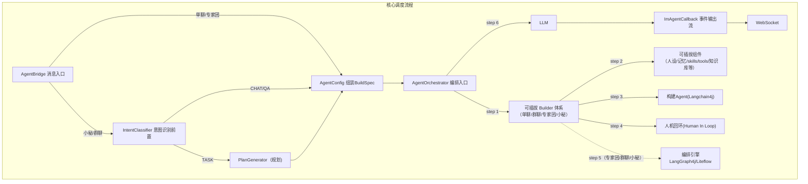

## ASCII 版业务架构图（按层级补充）

```text
┌─────────────────────────────────────────────────────────────────────────────────┐
│                           接 入 层 (Access Layer)                                │
│   ┌────────┐   ┌────────┐   ┌────────┐   ┌────────┐                            │
│   │WebSocket│   │  HTTP  │   │ STDIO  │   │  gRPC  │                            │
│   └───┬────┘   └───┬────┘   └───┬────┘   └───┬────┘                            │
└───────┼────────────┼────────────┼────────────┼──────────────────────────────────┘
        │            │            │            │
        └────────────┴──────┬─────┴────────────┘
                            ▼
┌─────────────────────────────────────────────────────────────────────────────────┐
│                                I M 层 (IM Layer)                                 │
│  ┌──────────┐  ┌──────────────────────────────┐  ┌─────────────────────────┐   │
│  │  用户管理  │  │         Agent 管理            │  │        会话管理          │   │
│  │登录/注册/ │  │ 模型/prompt/skills/tools/mcp/ │  │  小秘 / 单聊 / 群聊 /   │   │
│  │ 密码      │  │ 知识库 / 人设 等              │  │       专家团            │   │
│  └─────┬────┘  └──────────────┬───────────────┘  └────────────┬────────────┘   │
│        │                      │                                │                │
│  ┌─────┴──────────────┐      │                                │                │
│  │    人机回环管理     │      │                                │                │
│  │ 工具/人工确认节点/  │      │                                │                │
│  │ 紧急停止 / 打断 等  │      │                                │                │
│  └─────┬──────────────┘      │                                │                │
│        │                     │                                │                │
│  ┌─────┴─────────────────────┴────────────────────────────────┘                │
│  │                    其 他（定时任务 / 文件 / Token 用量 等）                    │
│  └─────────────────────────────────────────────────────────────────────────────┘ │
└────────────────────────────────────────────────┬──────────────────────────────────┘
                                                 │
                                                 ▼
┌─────────────────────────────────────────────────────────────────────────────────┐
│                              引 擎 层 (Engine Layer)                             │
│  ┌─────────────────────────────────────────────────────────────────────────────┐│
│  │                       AgentOrchestrator（统一编排入口）                       ││
│  └───────────────────────────────┬─────────────────────────────────────────────┘│
│                                  │                                               │
│      ┌───────────────────────────┴───────────────────────────┐                   │
│      ▼                                                       ▼                   │
│  ┌──────────────────────┐                          ┌─────────────────────────┐  │
│  │     Builder 体系      │                          │      执行管线体系        │  │
│  │  ┌────────────────┐  │                          │  ┌───────────────────┐  │  │
│  │  │SingleAgentBuilder│ │                          │  │      自主规划      │  │  │
│  │  │  GroupBuilder  │  │                          │  │ 小秘/群聊/专家团   │  │  │
│  │  │ConciergeBuilder│──┼──────────────────────────┼─▶│                   │  │  │
│  │  │ WorkflowBuilder│  │                          │  └─────────┬─────────┘  │  │
│  │  └────────────────┘  │                          │            │            │  │
│  │          │            │                          │  ┌─────────▼─────────┐  │  │
│  │          ▼            │                          │  │ ConciergePipeline │  │  │
│  │  ┌────────────────┐  │                          │  │ WorkflowPipeline  │  │  │
│  │  │    可插拔组件    │  │◀─────────────────────────┤  └─────────┬─────────┘  │  │
│  │  │  · Skills 系统  │  │  (Agent 管理提供配置)    │            │            │  │
│  │  │  · 知识库       │  │                          │  ┌─────────▼─────────┐  │  │
│  │  │  · Tools 系统   │  │                          │  │ LangGraph4j       │  │  │
│  │  │  · 人设         │  │                          │  │ LiteFlow          │  │  │
│  │  │  · 记忆系统     │  │                          │  └─────────┬─────────┘  │  │
│  │  └────────────────┘  │                          │            │            │  │
│  └──────────────────────┘                          │  ┌─────────▼─────────┐  │  │
│                                                    │  │  SinglePipeline   │  │  │
│                                                    │  └─────────┬─────────┘  │  │
│                                                    │            │            │  │
│                                                    │  ┌─────────▼─────────┐  │  │
│                                                    │  │   LangChain4j     │  │  │
│                                                    │  │  （基础 Agent 运行时）│  │  │
│                                                    │  └───────────────────┘  │  │
│                                                    └─────────────────────────┘  │
└─────────────────────────────────────────────────────────────────────────────────┘
```

### 关系说明

- **接入层 → IM 层**：所有接入协议（WebSocket / HTTP / STDIO / gRPC）统一汇聚到 IM 层进行会话与请求管理。
- **IM 层内部关系**：
  - `会话管理` 按类型（小秘 / 单聊 / 群聊 / 专家团）将请求路由到引擎层的不同 `Builder`。
  - `Agent 管理` 向下为 `Builder 体系` 与 `可插拔组件` 提供配置：模型、Prompt、Skills、Tools、MCP、知识库、人设等。
  - `人机回环管理` 在执行过程中介入，负责工具确认、人工节点、紧急停止 / 打断等。
- **IM 层 → 引擎层**：IM 层将组装好的 BuildSpec / 请求送入 `AgentOrchestrator` 统一编排。
- **引擎层内部关系**：
  - `AgentOrchestrator` 是统一入口，向下分发到 `Builder 体系` 与 `执行管线体系`。
  - `Builder 体系`（SingleAgentBuilder / GroupBuilder / ConciergeBuilder / WorkflowBuilder）负责根据场景构建 Agent 或执行计划。
  - `可插拔组件`（Skills / 知识库 / Tools / 人设 / 记忆系统）被 `Builder` 与 `执行管线` 共同依赖。
  - `执行管线体系` 自顶向下依次为：`自主规划` → `ConciergePipeline / WorkflowPipeline` → `LangGraph4j / LiteFlow` → `SinglePipeline` → `LangChain4j` 基础运行时。


